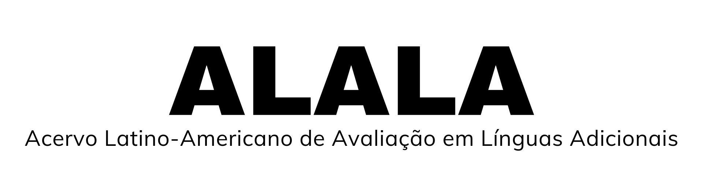

  

Olá! Seja bem-vindo(a) à pagina oficial do ALALA.

## 🎯 O que é este projeto?

Este é um repositório de acesso aberto que armazena a produção acadêmica (artigos, teses, dissertações) sobre **Avaliação de Línguas Adicionais na América Latina e nos países falantes de Língua Portuguesa**.
Este projeto é o produto derivado da dissertação de Nátalia Cardozo, defendida no Programa de Pós-Graduação em Línguistica Aplicada da Universidade de Brasília.

## 📂 Como usar o acervo?

* **[Navegue pela base de dados (EM BREVE)]()**
* **[Leia a dissertação completa (EM BREVE)]()**

## ⚖️ Como citar

Se você usar estes dados, por favor, cite os autores do texto escolhido e também o repositório:

Cardozo, Nátalia. (2026). *ALALA: Acervo Latino-Americano de Avaliação em Línguas*. Repositório GitHub. Disponível em: https://github.com/natariacardozo/alala

## ✉️ Contato

* Nátalia Cardozo - nataliacardozo.unb@gmail.com
